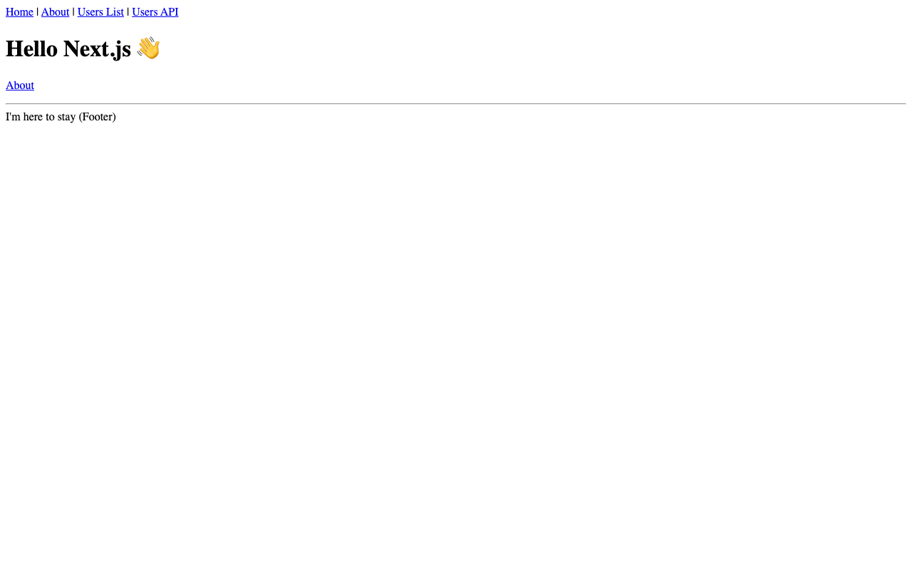

# Website Audit Tool

**Get a comprehensive audit of your website's messaging, UX, and content effectiveness.**

Enter any URL and get a detailed analysis of what's working, what's not, and specific fixes prioritized by impact. Like having a UX consultant review your site in 3 minutes.

🔗 **Live app:** [website-audit.vercel.app](https://website-audit.vercel.app)

---

## What it does

1. **Crawls your website** - Analyzes homepage and key pages
2. **Evaluates messaging** - Is your value prop clear? Are you speaking to the right audience?
3. **Checks UX patterns** - Navigation, CTAs, content hierarchy
4. **Identifies issues** - Ranked by business impact
5. **Provides fixes** - Copy-paste rewrites you can implement immediately

## Screenshot



## Tech stack

- **Next.js 16** (App Router)
- **Claude API** for intelligent analysis
- **Vercel KV** for result storage
- **Resend** for email delivery
- **Tailwind CSS** for styling

## Features

- 🔍 Multi-page crawling and analysis
- 🎯 Industry-specific recommendations
- 📊 10 prioritized issues with severity ratings
- ✏️ Copy-paste rewrite suggestions
- 🔗 Shareable audit reports
- 📧 Email delivery of results

## Local development

```bash
git clone https://github.com/lee-fuhr/website-audit.git
cd website-audit
npm install
cp .env.example .env.local
# Add your API keys
npm run dev
```

## Environment variables

```
ANTHROPIC_API_KEY=     # Required - Claude API
KV_REST_API_URL=       # Vercel KV
KV_REST_API_TOKEN=     # Vercel KV
RESEND_API_KEY=        # Email delivery
```

## Related tools

- [The Commodity Test](https://commodity-test.vercel.app) - Quick messaging score
- [Proposal Analyzer](https://proposal-analyzer.vercel.app) - Audit sales proposals

---

Built by [Lee Fuhr](https://leefuhr.com) • Messaging strategy for companies that make things
